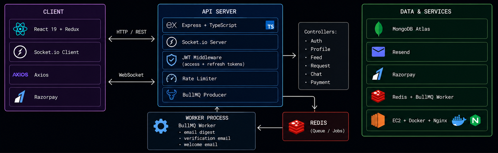
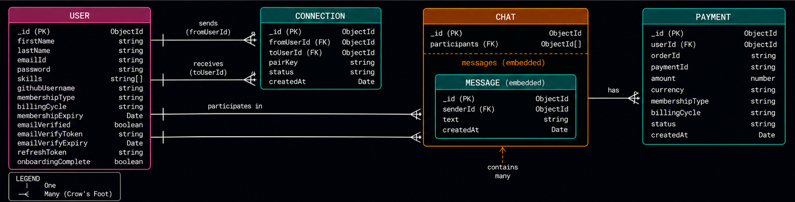

# DevLink — Backend

REST API for a developer discovery and networking platform. Real-time chat, online presence, connection requests, premium memberships, and automated email — built with Node.js, Express, TypeScript, and MongoDB.

**Live:** [linkdev.online](https://linkdev.online) &nbsp;·&nbsp; **Frontend:** [devlink-frontend](https://github.com/Dhruv-Raichand/devlink-frontend)

---



---

## Tech stack

|            |                                                             |
| ---------- | ----------------------------------------------------------- |
| Runtime    | Node.js + Express + TypeScript                              |
| Database   | MongoDB Atlas + Mongoose                                    |
| Auth       | JWT access (15m) + refresh (30d) tokens in httpOnly cookies |
| Real-time  | Socket.io                                                   |
| Email      | Resend                                                      |
| Scheduling | node-cron                                                   |
| Queue      | BullMQ + Redis                                              |
| Workers    | Dedicated worker process                                    |
| Payments   | Razorpay (webhooks + signature verify)                      |
| Security   | bcrypt · express-rate-limit · validator                     |
| Deployment | AWS EC2 · Nginx · Docker Compose · GitHub Actions           |

---

## Architecture

Three layers: React client ↔ Express/Socket.io API ↔ MongoDB + AWS.

The API serves both REST (HTTP) and real-time (WebSocket) on the same server. Socket.io maintains an in-memory `onlineUsers` map (`userId → socketId`) that controllers import directly — no message queue needed for targeted push notifications at this scale.

A separate **worker process** runs alongside the API and handles all async jobs: daily email digests and post-payment membership activation. Both processes share a Redis instance via BullMQ.

---

## Auth flow

New users complete a four-step flow: register → verify email (token sent via queue) → login (issues access + refresh tokens) → onboarding. Access tokens expire in 15 minutes; the `/refresh` endpoint issues a new one from the 30-day refresh token stored in an httpOnly cookie.

---

## Database schema



**Key design decisions:**

- **`pairKey` on Connection** — sorted, underscore-joined user ID pair with a unique index. Prevents duplicate bidirectional connections at the DB level, not just application level.
- **Hashed chat rooms** — SHA-256 of sorted user ID pair. Both participants always derive the same room ID regardless of who opens the chat first.
- **Messages as subdocuments** — embedded in `Chat` with `timestamps: true` so `createdAt` is automatic on push.
- **Payments collection** — stores Razorpay order/payment IDs, membership tier, billing cycle, and verification status. Worker activates membership only after webhook signature is verified.

---

## Real-time events

| Direction       | Event                        | Description                                                                                   |
| --------------- | ---------------------------- | --------------------------------------------------------------------------------------------- |
| Client → Server | `register`                   | Maps userId to socket. Server replies with `onlineList` snapshot and broadcasts `userOnline`. |
| Client → Server | `joinChat`                   | Joins the hashed conversation room.                                                           |
| Client → Server | `sendMessage`                | Persists to MongoDB, emits to room, sends `newNotification` to target if online.              |
| Server → Client | `newNotification`            | Targeted. Types: `message`, `request`, `request_accepted`.                                    |
| Server → Client | `userOnline` / `userOffline` | Broadcast on register / disconnect.                                                           |
| Server → Client | `onlineList`                 | Full snapshot sent only to the registering socket on connect.                                 |

---

## Background jobs (BullMQ)

| Queue        | Trigger              | Description                                  |
| ------------ | -------------------- | -------------------------------------------- |
| `emailQueue` | node-cron daily      | Digest jobs for users with pending requests. |
| `emailQueue` | signup               | Verification email on new registration.      |
| `emailQueue` | signup (post-verify) | Welcome email after email is confirmed.      |

The `worker` service is a separate process (`npm run worker`) that processes email jobs with a rate limit of 2 emails/sec and concurrency of 5. This keeps email delivery off the main request thread entirely.

Membership activation is handled synchronously in the Razorpay webhook handler — signature is verified via `validateWebhookSignature`, and the user document is updated inline on `payment.captured`. The idempotency guard (`if payment.status === 'captured' return early`) prevents double-upgrades if Razorpay retries the webhook.

---

## Interesting problems solved

**Re-send after ignore** — if a user was `ignored` more than 30 days ago, the stale document is deleted before saving the new request. Feed TTL and request TTL stay in sync.

**Notification routing without a queue** — controllers import `io` and `onlineUsers` directly from `socket.ts`. Works because `initializeSocket` runs at startup before any request hits a controller, so the exported `let io` is always initialised.

**Tiered rate limiting** — two separate limiters: `authLimit` (10 req / 15 min) on `/signup` and `/login` with exact retry-after time in the response body; `resendVerificationLimit` (3 req / 5 min) on `/resend-verification` to prevent email abuse.

**Razorpay webhook security** — signature is verified using `crypto.createHmac` against `RAZORPAY_WEBHOOK_SECRET` before any membership state is mutated. Invalid payloads are rejected with 400 before they touch the database.

---

## API routes

<details>
<summary>Auth · Profile</summary>

| Method | Route                          | Notes                                                    |
| ------ | ------------------------------ | -------------------------------------------------------- |
| POST   | `/signup`                      | Rate limited. Registers user ans send verification mail. |
| POST   | `/login`                       | Rate limited. Sets JWT cookie.                           |
| POST   | `/logout`                      | Clears cookies.                                          |
| POST   | `/refresh`                     | Refresh Tokens.                                          |
| GET    | `/verify-email`                | verify email with token.                                 |
| POST   | `/resend-verfication`          | Rate limited. resend verificaition email.                |
| GET    | `/profile`                     | Own profile via cookie auth.                             |
| PATCH  | `/profile/edit`                | Update fields.                                           |
| PATCH  | `/profile/password`            | Change password.                                         |
| GET    | `/profile/:userId`             | Safe fields only.                                        |
| POST   | `/profile/onboarding/complete` | Marks Onboarding completed.                              |

</details>

<details>
<summary>Feed · Connections · Requests · Chat · Skills</summary>

| Method | Route                                | Notes                           |
| ------ | ------------------------------------ | ------------------------------- |
| GET    | `/user/feed`                         | `?page&limit&skills=React,Node` |
| GET    | `/user/connections`                  | Accepted connections.           |
| GET    | `/user/requests/received`            | Pending.                        |
| GET    | `/user/requests/sent`                | Pending.                        |
| POST   | `/request/send/:status/:toUserId`    | `interested` or `ignored`.      |
| POST   | `/request/review/:status/:requestId` | `accepted` or `rejected`.       |
| DELETE | `/request/withdraw/:requestId`       |                                 |
| DELETE | `/request/connection/:userId`        |                                 |
| GET    | `/chat/recent`                       | Last message per conversation.  |
| GET    | `/chat/:targetUserId`                | Full history.                   |
| GET    | `/skills`                            | Predefined skills list.         |

</details>

<details>
<summary>Payments · Membership</summary>

| Method | Route              | Notes                                              |
| ------ | ------------------ | -------------------------------------------------- |
| POST   | `/payment/order`   | Creates Razorpay order, returns `orderId`.         |
| POST   | `/payment/verify`  | Verifies signature, enqueues membership job.       |
| POST   | `/payment/webhook` | Razorpay server-side webhook (signature verified). |
| GET    | `/payment/status`  | Current membership tier and expiry for auth user.  |

</details>

---

## Docker Compose

```yaml
services:
  backend:
    build: .
    container_name: backend
    ports:
      - '3000:3000'
    depends_on:
      - redis
    env_file:
      - .env
    environment:
      - NODE_ENV=production
      - REDIS_HOST=redis
      - REDIS_PORT=6379
    restart: always

  worker:
    build: .
    container_name: worker
    depends_on:
      - redis
    env_file:
      - .env
    environment:
      - NODE_ENV=production
      - REDIS_HOST=redis
      - REDIS_PORT=6379
    command: npm run worker
    restart: always

  redis:
    image: redis:7-alpine
    container_name: redis
    ports:
      - '6379:6379'
    volumes:
      - redis_data:/data
    restart: always

volumes:
  redis_data:
```

`backend` and `worker` share the same image but run different entry points. Redis data is persisted via a named volume so the queue survives container restarts.

---

## Setup

```bash
git clone https://github.com/Dhruv-Raichand/devlink-backend.git
cd devlink-backend && npm install
cp .env.example .env
npm run dev
```

```env
PORT=3000

MONGODB_URI=mongodb+srv://...

# Generate with: node -e "console.log(require('crypto').randomBytes(64).toString('hex'))"
ACCESS_TOKEN_SECRET_KEY=your_secret_here
REFRESH_TOKEN_SECRET_KEY=your_secret_here

ACCESS_TOKEN_EXPIRY=15m
REFRESH_TOKEN_EXPIRY=30d

FRONTEND_URL=http://localhost:5173

RAZORPAY_KEY_ID=****************
RAZORPAY_KEY_SECRET=****************
RAZORPAY_WEBHOOK_SECRET=****************

RESEND_API_KEY=****************
FROM_EMAIL=noreply@yourdomain.com

REDIS_HOST=redis
REDIS_PORT=6379
```

```bash
npm run dev     # ts-node-dev hot reload
npm run build   # tsc compile
npm start       # run compiled output
npm run worker  # start BullMQ worker process
```

**Docker (production):**

```bash
docker compose up --build -d
```

---

_[Dhruv Raichand](https://github.com/Dhruv-Raichand) · DevLink © 2026_
